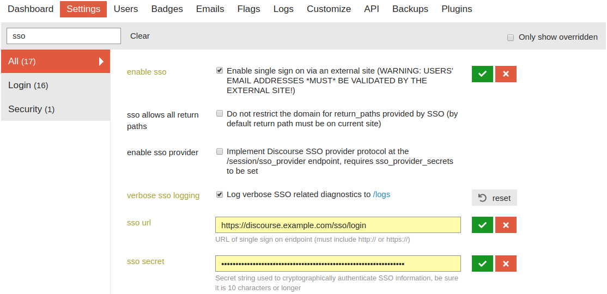

# Discourse SSO OIDC Bridge - A Python PyPI package and a Docker image

[](https://pypi.python.org/pypi/discourse-sso-oidc-bridge-consideratio)
[](https://github.com/consideratio/discourse-sso-oidc-bridge/actions)
[](https://hub.docker.com/r/consideratio/discourse-sso-oidc-bridge/tags)

This Python package contains a Flask application that when deployed can be used
as and endpoint for Discourse when setting up it's SSO. It will then be able to
wrap a OIDC provider and avoid various [limitations](https://meta.discourse.org/t/sso-vs-oauth2-difference/76543/11)
of not being setup as a Discourse SSO provider.

The Flask application can be deployed using a Docker image that is also within
this repo and published to docker hub as
`consideratio/discourse-sso-oidc-bridge`.

This repo was made standing on the shoulders giants who made most of the initial
work. Thank you [**@fmarco76**](https://github.com/fmarco76) and
[**@stevenmirabito**](https://github.com/stevenmirabito) for the valuable work
you have made!

- https://github.com/fmarco76/DiscourseSSO
- https://github.com/ComputerScienceHouse/DiscourseOIDC

I also did some Dockerfile refinements thanks to
[**@greut**](https://github.com/greut)'s excellent [Medium
article](https://medium.com/@greut/building-a-python-package-a-docker-image-using-pipenv-233d8793b6cc).

## Installation

Note that this only installs a Python package containing a Flask application,
you must use `gunicorn` or another WSGI compatible webserver to host it and
setup TLS etc.

```sh
pip install --upgrade discourse-sso-oidc-bridge-consideratio
```

To startup a the Flask app within a prebuilt Docker image, do the following.

```sh
docker run --rm -p 8080:8080 consideratio/discourse-sso-oidc-bridge
```

To actually use it, you should make it deployed in a way that it is accessible
for discourse and its users, so it can redirect arriving users who wants to
login to it. To do this, visit the discourse settings and search for `sso`.



> **NOTE:** When you do this setup, you want to check and fill in `enable sso`,
> `sso url`, and `sso secret`. What you write in your `sso secret` should be
> repeated in your bridge configuration.

## Bridge Configuration

These are common configuration options, but you can find some more exotic ones within [default.py](discourse-sso-oidc-bridge/default.py).

To configure these, you have two options.

- You can provide provide a Python based config file and set the `CONFIG_LOCATION` environment variable allowing the application to locate it.

  ```python
  #######################
  # Flask Configuration #
  #######################

  DEBUG = True
  SECRET_KEY = 'my-secret-key-that-i-came-up-with-myself'

  # NOTE: Relates to OIDC_SESSION_PERMANENT as well.
  #       http://flask.pocoo.org/docs/1.0/config/#PERMANENT_SESSION_LIFETIME
  # NOTE: You may want to learn about the "maximum session age" setting in discourse
  #       as well.
  # PERMANENT_SESSION_LIFETIME = 2678400


  ################################
  # OpenID Connect Configuration #
  ################################

  # NOTE: Relates to PERMANENT_SESSION_LIFETIME as well.
  #       https://github.com/zamzterz/Flask-pyoidc#flask-configuration
  # OIDC_SESSION_PERMANENT = True

  # NOTE: If you add /.well-known/openid-configuration to your OIDC_ISSUER, you should get a bunch of JSON details back if you got it right.
  OIDC_ISSUER = 'https://my-oidc-provider.com'
  OIDC_CLIENT_ID = 'my-client-id-from-my-oidc-provider'
  OIDC_CLIENT_SECRET = 'my-secret-key-from-my-oidc-provider'
  OIDC_SCOPE = 'openid profile email offline_access'
  OIDC_REDIRECT_URI = 'https://discourse-sso.example.com/redirect_uri'

  ###########################
  # Discourse Configuration #
  ###########################

  DISCOURSE_URL = 'https://discourse.example.com'
  DISCOURSE_SECRET_KEY = 'my-other-secret-that-i-came-up-with-myself'
  ```

- You can set environment variables with the same name as the config options.
  The default python config will look in these environment variables and use
  them if available.

| **Config / ENV name**            | **Description**                                                                                                                                                                    |
| -------------------------------- | ---------------------------------------------------------------------------------------------------------------------------------------------------------------------------------- |
| `DEBUG`                          | Very useful while setting this up as you get lots of additional logs, but also sensitive information. Defaults to `False`.                                                         |
| `SECRET_KEY`                     | A secret for Flask, just generate one with `openssl rand -hex 32`.                                                                                                                 |
| `OIDC_ISSUER`                    | An URL to the OIDC issuer. To verify you get this right you can try appending `/.well-known/openid-configuration` to it and see if you get various JSON details rather than a 404. |
| `OIDC_CLIENT_ID`                 | A preregistered `client_id` on your OIDC issuer.                                                                                                                                   |
| `OIDC_CLIENT_SECRET`             | The provided secret for the the preregistered `OIDC_CLIENT_ID`.                                                                                                                    |
| `OIDC_SCOPE`                     | Comma or space seperated OIDC scopes, defaults to `"openid profile"`.                                                                                                              |
| `OIDC_REDIRECT_URI`              | The URL you register with your identity provider, should include `https://` and end with `/redirect_uri`.                                                                          |
| `OIDC_EXTRA_AUTH_REQUEST_PARAMS` | Valid JSON object in a string containing key/values for additional parameters to be sent along with the initial request to the OIDC provider, defaults to `"{}"`.                  |
| `DISCOURSE_URL`                  | The URL of your Discourse deployment, example `"https://discourse.example.com"`.                                                                                                   |
| `DISCOURSE_SECRET_KEY`           | A shared secret between the bridge and Discourse, generate one with `openssl rand -hex 32`.                                                                                        |
| `USERINFO_SSO_MAP`               | Valid JSON object in a string mapping OIDC userinfo attribute names to to Discourse SSO attribute names.                                                                           |
| `DEFAULT_SSO_ATTRIBUTES`         | Valid JSON object in a string mapping Discourse SSO attributes to default values. By default `sub` is mapped to `external_id` and `preferred_username` to `username`.              |
| `CONFIG_LOCATION`                | The path to a Python file to be loaded as config where `OIDC_ISSUER` etc. could be set.                                                                                            |

## OIDC Provider Configuration

You must have a `client_id` and `client_secret` from your OIDC issuer. The
issuer must also accept redirecting back to
`<PREFERRED_URL_SCHEME>://<bridge_url>/redirect_uri`, which for example could be
`https://discourse-sso.example.com/redirect_uri`.

## Development Notes

### To make changes and test them

1. Clone the repo

1. Install dependencies

   ```sh
   pip install -r dev-requirements.txt -r requirements.txt
   ```

1. Install package locally

   ```sh
   pip install -e .
   ```

1. Run tests

   ```sh
   pytest
   ```

### Build and upload a PyPI release

1. Run tests and tag a commit.

   ```sh
   # Make sure you dev requirements are up to date
   pip install -r dev-requirements.txt

   # Freeze requirements.in to requirements.txt
   pip-compile

   # Run tests
   pytest

   # Verify that the Dockerfile can build and start
   docker build --tag discourse-sso-oidc-bridge:local . && docker run --rm discourse-sso-oidc-bridge:local

   # Commit and tag to influence the PyPI version
   # PBR will look for the latest tag and then append development
   # versions based on your git commits since the latest tag.
   git add .
   git commit

   TAG=$(python -c 'from pbr.version import VersionInfo; print(VersionInfo("discourse_sso_oidc_bridge").version_string())')
   git tag -a $TAG -m "Release $TAG"

   # Let PBR update the ChangeLog
   # FIXME: Can I update the ChangeLog in a more minimalistic way?
   python setup.py install

   git add .
   git commit -m "Update ChangeLog"
   ```

2. Push git commits and tags to trigger CD of Docker image and PyPI packaging
   through a GitHub workflow.

   ```sh
   git push --follow-tags
   ```

3. Verify CD of Docker image and PyPI package.

   Visit
   [DockerHub](https://hub.docker.com/repository/docker/consideratio/discourse-sso-oidc-bridge/builds)
   to verify the build succeeds.

   Visit [GitHub
   Actions](https://github.com/consideRatio/discourse-sso-oidc-bridge/actions)
   to verify the release build succeeds.

   Visit
   [PyPI](https://pypi.org/project/discourse-sso-oidc-bridge-consideratio/) and
   release has been published.

## Deployment notes

I have deployed this using a simpler not published Helm chart. I'm happy to open
source this as well for a complete solution. But to avoid overworking something
that few has interest for it in I'd appreciate if you showed interest in this by
emailing me or opening an issue or similar.
